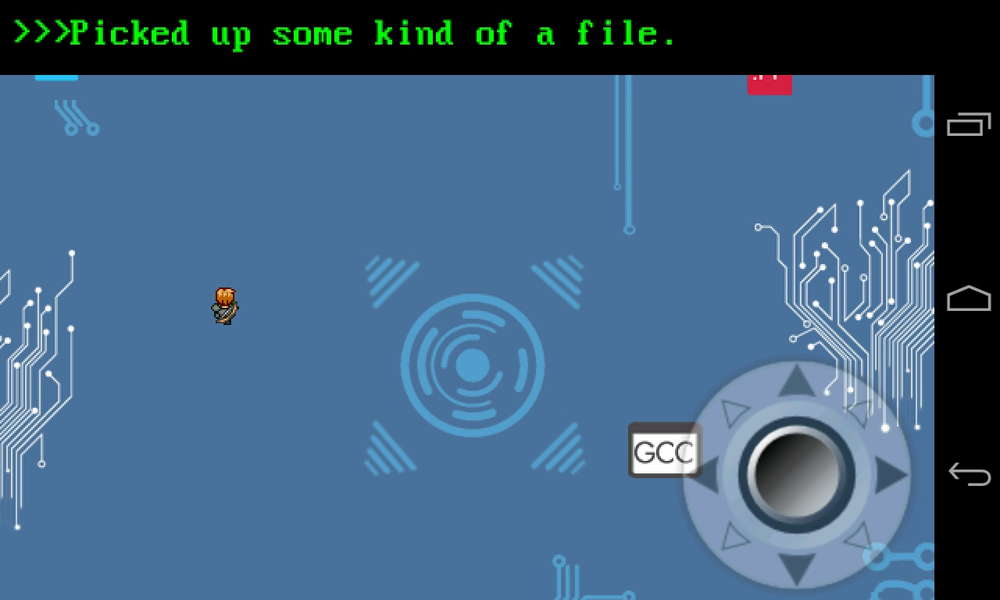

#Root Runner
An open source game for Android
Built by CS349 students at Eastern Washington University


###How to build
***
Pull down a copy of AndEngine from our repo.

```
git checkout develop
git checkout -b feature_x
git submodule init
git submodule update
``` 
Import the project into Android Studio as a gradle project. Choose the local gradle wrapper when asked.


